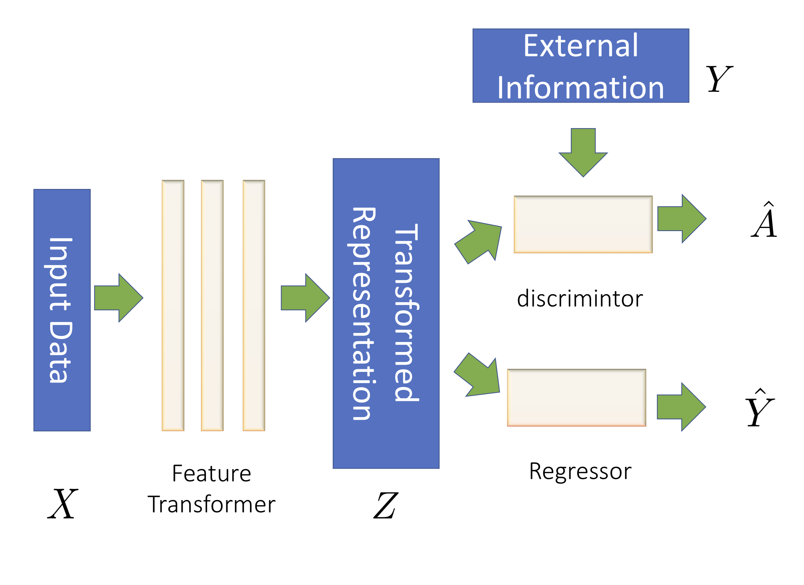

# Understanding and Mitigating Accuracy Disparity in Regression

Official codes for the paper "Understanding and Mitigating Accuracy Disparity in Regression".


## Summary



Essentially, our algorithms contain three components:

* A feature transformer, parametrized by a neural network;

* A regressor for the desired task.

*  A discrimintor that takes the transformed features and the label the desired task as inputs and output the predicted sensitive attributes.

In each iteration, 

1. The feature transformer + regressor try to learn informative representation for desired task regression task;

2. The feature transformer + discrimintor form a two-player game, where the feature extractor tries to learn a group-invariant representation and the discrimintor tries to distinguish which group the given sample is from given the representation and the label.


More details could be found section 3.2 and section 4 in our paper.


## Prerequisites

You need Python 3.6 or later to run our codes. Please also install the required packages: 

```
pip install -r requirements.txt
```

## Usage

To get the preprocess datasets, please run the following python scripts:

```
python prep_adult.py && python prep_crime.py && python prep_law.py && python prep_insurance.py
```

However, there is no need to do this step in our repo, since we already provide the preprocessed datasets in the data folder.

To run CENet in our paper with the coefficient for the adversarial loss 1.0, please run:

```
python main_adult.py --model CENet --mu 1.0
```

To run WassersteinNet in our paper with the coefficient for the adversarial loss 1.0, please run:

```
python main_adult.py --model wmlp --mu 1.0
```

To run the regression net that solely minimize the MSE loss, please run:

```
python main_adult.py --model mlp
```

The usages for other datasets are the same.


## Reference

If you use this code for your research and find it helpful, please cite our paper
```
@inproceedings{chi2021understanding,
  title={Understanding and Mitigating Accuracy Disparity in Regression},
  author={Chi, Jianfeng and Tian, Yuan and Gordon, Geoffrey J and Zhao, Han},
  booktitle={International conference on machine learning},
  year={2021}
}
```

## Contact

Please email to [jc6ub@virginia.edu](mailto:jc6ub@virginia.edu) should you have any questions or comments.
